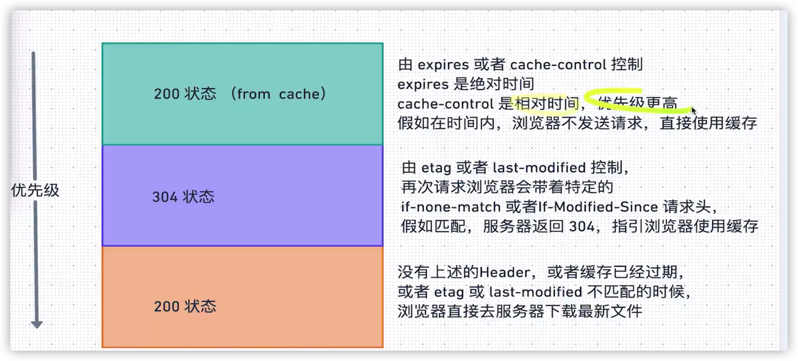

# 杂项

## 图片下载的场景

1. 同源图片：直接增加download属性，download属性的值可以是文件名，另外需要注意rel属性，是一个网络安全相关的知识，需要设置为noopener，这样打开的图片拿不到原网页的信息
2. 非同源支持跨域：直接使用ajax请求，到blob文件后用URL.createObjectUrl，创建链接下载，注意文件大的话可能会是异步的，并且需要使用URL.revokeURLObject，去释放资源
3. 非同源不支持跨域：需要为用户手动打开一个页面地址，让用户能够手动下载图片

